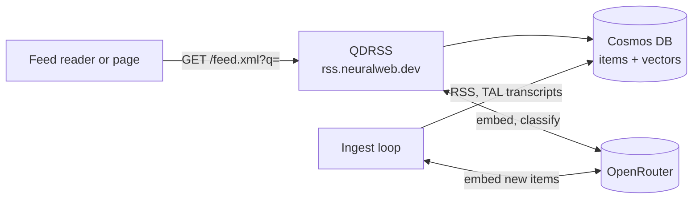

# Life of a query: QDRSS (query-defined RSS)

*Design document, 2026-10-09. Covers `rssnlweb` as deployed in revision `qdrss-00034-zix`. Every claim carries a file and line reference; numbers marked "measured" were read from the running service the same day. Sibling documents: `ard-finder/docs/life-of-a-query.md`, `NeuralKG2/docs/life-of-a-query.md`, `nlweb-samples/docs/life-of-a-query.md`.*

## 0. How to read this

QDRSS (at `rss.neuralweb.dev`) turns a **standing interest** written as a sentence into an **RSS feed**: the recent items (episodes, or transcript passages) of a collection that a model judged to match it. You subscribe to the topic, not to a show. It is used by the NYT, NPR and This American Life pages and by any feed reader.

QDRSS does not call ARD or NeuralKG2. It shares only the model provider (OpenRouter) and the principle that a model judges and code does everything else.

### Words used throughout

- **Collection**: a named group of sources in `sources.yaml` (`nytimes`, `npr`, `tal`, `ai`, ...). A feed can be restricted to one.
- **Item**: one stored record: an episode (title plus description), or for This American Life one **passage** of a transcript.
- **Ingest time**: when the service first saw an item. A feed's default window and its ordering use it, not the publication date.
- **Strong / relevant / exclude**: the model's verdict on one candidate against the interest.

## 1. Where QDRSS sits



One Starlette app on Cloud Run (`qdrss`, `us-central1`). Items and vectors are in Cosmos DB in production; locally, SQLite plus an in-memory numpy index. Models: embeddings `openai/text-embedding-3-small` (1536 dimensions), classification `openai/gpt-oss-20b`.

## 2. The life of a feed query

QDRSS turns a **standing interest** into an RSS feed. The interest is a sentence; the feed is the recent items (or passages) of a collection that a model judged to match it. Source: `rssnlweb` (`src/qdrss/`).

There are two halves: ingestion keeps the corpus current, and `/feed.xml` answers an interest against it.

### 2.1 The corpus (ingestion)

**Sources.** `sources.yaml` maps collection names to lists of `{name, url[, segmenter]}`. Twelve collections: `ai`, `history`, `finance`, `international`, `cricket`, `american_football`, `soccer`, `nonprofit`, `war`, `nytimes` (73 shows), `npr` (97 shows) and `tal` (This American Life, one segmented source). `/collections` reports sources and items per collection (for example `npr` 55,302 items, `tal` 28,444 passages, `nytimes` 8,776 items).

**Fetch** (`ingest.py:94-148`). All sources are fetched concurrently (semaphore of 4, 30 s timeout). Requests are conditional (stored ETag and Last-Modified); a 304 or an unchanged body hash is skipped. A new source's RFC 5005 archive pages (`rel="next"`, up to 200 pages) are followed once, so the full back catalogue is ingested. A feed is parsed **before** its validators are saved, so a malformed body never poisons the next fetch. A source that fails keeps its old items and records `last_error`; one failing source never blocks the others.

**Parse** (`feeds.py`). RSS 2.0 and Atom. Text is `content:encoded` or `description`, tags stripped. The item id is `"{source}:{guid or url or hash(title,date)}"`. Items are **append-only**: an upstream edit is ignored. `ingested_at` is the time of first sight.

**Transcript passages** (`tal.py`). For the `tal` source the feed is only a list of episode numbers and audio links. For each episode the service fetches the transcript page (`thisamericanlife.org/<n>/transcript`), the episode page (air date) and the audio URL; a 5xx on the transcript falls back to the newest Internet Archive capture that carries timestamps. The transcript is cut into **acts**, and each act into **windows of at least 280 words** that never cross an act (a tail under 80 words merges into the previous window; a speaker label is added when the speaker changes). Each window is one item: id `tal_this_american_life:<episode>:<act id>:<nnn>`, title "episode title: act", `published_at` the air date, and an `extra` record with `episode`, `act`, `start`, `end` (seconds), the transcript anchor and `audio` as `<mp3>#t=<start>`. That `extra` is what lets a result say "which episode, which act, and the exact time to press play". The back catalogue (episodes 1 to 899) was loaded with `scripts/backfill_tal.py`, back-dating `ingested_at` to the air date.

**Embed** (`providers.py`, `app.py:112-126`). Text is `title + "\n" + content`, first 8000 characters, embedded with `openai/text-embedding-3-small` (1536 dimensions, L2-normalised) through OpenRouter. In production items are stored in Cosmos DB (one container, partitioned by collection, vector index `diskANN`, cosine); a background pass embeds items that have no vector yet. Locally the store is SQLite with an in-memory numpy index.

**When.** The app refreshes at start and then every `QDRSS_REFRESH_MINUTES` (1440, once a day). In production the refresh runs as a child process so a slow ingest cannot block queries; `qdrss-ingest` runs one refresh and exits. Both clear the feed cache.

### 2.2 A `/feed.xml` request

```
GET /feed.xml?q=<interest>[&collection=npr][&limit=40][&since=2000-01-01][&threshold=relevant|strong]
```

**1. Validate** (`app.py:221-245`). `q` required. `since` RFC 2822 or ISO 8601. `limit` 1-100 (default 20). `threshold` `relevant` or `strong`. `collection` must be one of the twelve. 503 while the index is not ready. There is no length cap on `q` and no rate limit in the code (any limit comes from infrastructure).

**2. Cache.** If `since` is absent the answer is cached by `(q, limit, threshold, collection, host)` for the refresh interval, and the response carries an `ETag` and `Cache-Control: public, max-age=900`, so feed readers poll cheaply. With `since` the answer is not cached.

**3. Window.** `since` defaults to now minus 7 days (`QDRSS_WINDOW_DAYS`): a feed shows what has been **ingested** recently, not what was published recently. The example pages pass `since=2000-01-01` ("include past episodes"), which is how back-dated archive items and transcript passages are reached.

**4. Embed the interest.** One embedding call per distinct interest and model (cached, up to 5000 entries). The raw sentence is embedded as written; nothing rewrites it.

**5. Retrieve 40 candidates** (`QDRSS_CANDIDATE_COUNT`). Cosmos: `SELECT TOP @k ... ORDER BY VectorDistance(c.embedding, @v)` with `ingested_ts > @since` and, when a collection is named, a single-partition filter. The date and collection masks are applied **before** the top-k, so the 40 are the best items among the eligible ones.

**6. Classify** (`rank.py`). The 40 candidates are cut into batches of 5 and sent to the ranking model (`openai/gpt-oss-20b`) in parallel (8 calls). The prompt asks it to act as a relevance **filter, not a ranker**: for each record say `strong` (directly satisfies the interest), `relevant` (substantially useful but partial) or `exclude`, with a one-sentence `why` of at most 25 words naming the specific topic. Input per record: title and the first 1500 characters. Output JSON `{"results":[{"i":0,"m":"strong","why":"..."}]}`, temperature 0, reasoning effort low. A bad index, a duplicate or an unknown category is dropped (treated as exclude). Retries: one retry of the provider call with the failed provider ignored, one retry of the batch, and the HTTP client's own retry; a provider that fails 3 times with a 30% failure share within an hour is ignored for routing.

**7. Threshold, order, limit.** `strong` keeps only strong; `relevant` keeps both. The survivors are sorted by **publication time, newest first** (ingestion time for an item without one) (the model's verdict and the similarity do not affect order), then cut to `limit`. So a feed is a chronological stream of the matching items, not a relevance ranking, and it may hold fewer than `limit` items because only 40 candidates are considered.

**8. Render** RSS 2.0. Channel title `rssnlweb: <q>`. Each item has the title, link, `guid` (the item id), `pubDate`, `source` (the show), a description `[strong] <why>` followed by the first 1000 characters of the text, and a `qd:` extension: `qd:category`, `qd:ingestedAt`, `qd:source`, and for transcript passages `qd:episode`, `qd:act`, `qd:offsetSeconds`, `qd:endSeconds`, `qd:transcript` and `qd:audio`.

### 2.3 Where QDRSS is deterministic and where it is not

Deterministic: parsing, ids, windowing of transcripts, retrieval for a fixed embedding, ordering, ETags. Model-driven: the embeddings and every strong/relevant/exclude verdict and `why`. The verdicts vary between providers even at temperature 0, which is why the status ledger (the status ledger at `neuralweb.dev/status`) judges the feeds independently with a stronger model.

### 2.4 Failure behaviour

| Condition | Result |
|---|---|
| Ranking provider fails after all retries | **503 "ranking unavailable"**; the whole request fails rather than serve a partial feed that would look like "nothing new" |
| Query embedding fails on a cache miss | unhandled, 500 |
| Index not ready | 503 |
| A source fails to fetch | its old items remain; `/health` shows the error |
| No candidates | an empty channel, 200 |
| No `OPENROUTER_API_KEY` | silently runs on hash embeddings and a keyword ranker, which are not semantic |
| A TAL episode has no timed transcript | skipped, retried on the next fetch |

## 3. Configuration (`config.py`)

| Setting | Default |
|---|---|
| `QDRSS_REFRESH_MINUTES` | 1440 |
| `QDRSS_WINDOW_DAYS` | 7 |
| `QDRSS_CANDIDATE_COUNT` | 40 |
| `QDRSS_DEFAULT_LIMIT` / `QDRSS_MAX_LIMIT` | 20 / 100 |
| `QDRSS_RANKING_BATCH_SIZE` | 5 |
| `QDRSS_FETCH_CONCURRENCY` | 4 |
| `OPENROUTER_RANKING_MODEL` | `openai/gpt-oss-20b` |
| `OPENROUTER_EMBEDDING_MODEL` | `openai/text-embedding-3-small` |
| `OPENROUTER_RANKING_PROVIDER_SORT` | `throughput` |
| `COSMOS_ENDPOINT`, `COSMOS_KEY`, `COSMOS_DATABASE` | empty, empty, `qdrss` |
| `QDRSS_INGEST_IN_APP` | true |
| `QDRSS_MEMORY_COLLECTIONS`, `QDRSS_MEMORY_SNAPSHOT` | empty (when both are set, the named collections are searched in memory) |
| `OPENROUTER_API_KEY` | empty: runs on hash embeddings and a keyword ranker |

## 4. Measured behaviour

From the status ledger (`neuralweb.dev/status`, 2026-10-09) and `/health`:

| | |
|---|---|
| Corpus | 563 sources in 12 collections, 305,398 items (`npr` 55,302; `tal` 28,444 passages; `nytimes` 8,776) |
| Example topics judged by a stronger model | NYT 47 of 48 pass, NPR 51 of 53, This American Life 14 of 17 |
| "Pass" | at least 5 returned items judged relevant and at least 60% of what came back |
| Variety of sources per feed query | NYT 3.9 distinct shows, NPR 9.6, This American Life 8.2 distinct episodes |
| Latency | not recorded per request until 2026-10-09; `/health` now reports median and 95th percentile (the first request after a deploy took 21 s) |

## 5. Invariants

1. **A ranking failure fails the request** (503); a partial feed would look like "nothing new" (`rank.py:3-5`, `app.py:263-265`).
2. **Items are append-only**: an upstream edit never rewrites a stored item (`store.py:486-508`, `cosmos.py:108-123`).
3. **A malformed feed never poisons the next fetch**: validators are saved only after the body parses (`ingest.py:127-139`).
4. **A feed is a chronological stream of matching items**, ordered by publication date, not by relevance (`feed.py`, `evaluate`).
5. **`since` filters on ingest time**, so back-dated archive items and transcript passages need a far-back `since`.
6. **Transcript passages never cross an act** (`tal.py:213-237`).

## 6. Open issues

- No rate limit and no query-length cap in the code.
- A query-embedding failure on a cache miss is an unhandled 500.
- The README says the vector index is `quantizedFlat`; the code creates `diskANN`.
- The ETag covers item ids only, so a changed `why` for the same ids does not change it.
- Cosmos search does not check that stored vectors were made by the current embedding model.
- Only 40 candidates are classified, so a feed can hold fewer than `limit` items.
- Transcript ingestion exists only for This American Life. NPR publishes speaker-labelled transcripts for Weekend Edition, Up First, Consider This, Throughline, Invisibilia and TED Radio Hour, with no timestamps (Fresh Air has none); nytimes.com refuses scripted fetches.
- `/health` counters are per instance; `/healthz` is answered by Cloud Run's front end, so use `/health`.

## 7. File map

| Concern | Where |
|---|---|
| Routes, caching, health | `src/qdrss/app.py`, `activity.py` |
| Feed evaluation and rendering | `src/qdrss/feed.py` |
| Classification | `src/qdrss/rank.py` |
| Providers (embedding, ranking, provider health) | `src/qdrss/providers.py` |
| Ingestion | `src/qdrss/ingest.py`, `feeds.py`, `tal.py` |
| Stores and indexes | `src/qdrss/store.py`, `cosmos.py`, `index.py`, `memory.py` |
| Sources | `sources.yaml` |
| Backfills and research | `scripts/backfill_tal.py`, `backfill_nyt_archive.py`, `export_snapshot.py`, `probe_transcripts.py`, `judge_feed_relevance.py` |
| Pages | `src/qdrss/static/` (`index.html`, `nyt.html`, `npr.html`, `tal.html`) |
